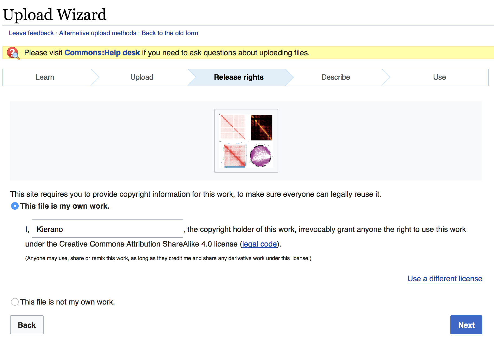

# Introduction

## Talk logistics

We have lots of time, please put your hand up with questions!

### What I'll talk about today

- Copyright and Open Access
- Uploading images to Wikipedia
- Using your assignment to gain money and fame 

### Slides 

You can get these slides at: 

[https://github.com/oneillkza/MedG505_Wikipedia](https://github.com/oneillkza/MedG505_Wikipedia)

I'll also ask your course assistant to email you a copy. 

## Where I'm coming from 

- Bioinformatics post-doc in the Karsan lab at BC Cancer
- Graduate of UBC Bioinformatics program
- Wikipedia contributor since 2004
	- Over 2.6K edits on a wide variety of topics
	- Author of six "did you know?" front page articles
	- Co-first author of a PLoS-CB topic page 
- Involved in the International Society for Computational Biology / Wikipedia collaboration

## ISCB/Wikipedia 

 ](images/bioinfo_2017.png)^[OUP. Used under CC-BY]

# Copyright and Open Access 

## Why am I teaching you about copyright and open access?

1. Wikipedia is open access and takes copyright very (very) seriously. By understanding copyright and open access, you can reduce your risk of delays in getting your work up (right before the deadline).

2. Many scientific journals (and other sources) have open access licenses compatible with Wikipedia. By understanding open access licenses, you can save time by reusing or adapting figures and data from journals in your assignment article.
	

## Copyright ©

- When you create an image, piece of text, or other "work", it is instantaneously copyrighted to you (©)
- This means nobody may reproduce it without your permission
	- No putting it anywhere on the internet without asking (social media, website, Wikipedia, etc) 
	- Some exceptions for fair use, e.g. academic uses, commentary, parody

### Upside 
 
- Copyright allows people who create content to be paid for their work. (e.g. musicians, artists, film makers)

### Downside

- Copyright creates barriers to the sharing of information. (e.g. scientific data, knowledge) 

## Open access (and open source) licenses

Some of us believe that allowing people to use our work for no cost (gratis) and in the way they like (libre) is good for science (and the world).

- e.g. within the scientific community, we have public databases, open access journals and open source software.
- Also Wikipedia
- All of these use open access (or open source) '''licenses'''.

An open access license allows a creator to pre-emptively grant permission to everybody to use their work.

- That removes the barrier of having to find you and ask you.
- Which makes the sharing of knowledge easier and more free. 

## Some open access licenses 

 ](images/cc_licenses.png)^[Wikipedia. Used under CC-BY]

Anything from CC-BY-SA up is compatible with Wikipedia

## How this impacts your assignment

### Keep Wikipedia happy

- The Wikipedia article you write will be released under a CC-BY-SA license.
- Make sure everything you submit to Wikipedia is license-compatible.
	- If it's a figure you created, make sure to license it CC-BY-SA (or similar)
	- If you got it from somewhere else, find the license and check the table on the last slide

### Save yourself time

- You can re-use figures from open access journal articles 
- You can also adapt figures from open access papers. 
- Check the license: CC-BY or similar is OK; CC-BY-NC is not 

## Open access journals where you can find free figures

# Uploading images to Wikipedia

## Why am I teaching you how to upload to Wikipedia? 

- The Wikipedia uploading system is Byzantine.
- In past years of this course, the number one issue has been students unable to upload figures the night before the deadline.
- I am hoping to reduce your stress around this process.

## Wikipedia vs Wikimedia Commons

- Both fall under the umbrella of the Wikimedia Foundation
- Wikipedia is the encyclopedia.
- Wikimedia Commons is a repository of open access images.

^[Wikimedia Foundation. Used under CC-BY]

### Why this matters

- Wikipedia allows uploads directly, and has its own upload wizard.
- But Wikipedia has special rules for fair use of non-free content.
	- In general this is bad and should be avoided.
	- Definitely avoid if you don't know exactly what you're doing!
- It is much bettehttps://en.wikipedia.org/wiki/Wikipedia:WikiProject_Computational_Biology/ISCB_competition_announcement_2018r to upload your images to Wikimedia Commons.
- They will be immediately visible, and you can use them directly in your Wikipedia article.

## Wikipedia upload dialogue (don't use!)

## Commons upload dialogue

## Upload the image 

## Release the image if it is your work

## Credit the authors and specify the license if not 

## Describe the image 

## Copy/paste your image link

## Use your image in Wikipedia

## Use your image in Wikipedia

[https://en.wikipedia.org/wiki/Chromosome_conformation_capture#Data_analysis](https://en.wikipedia.org/wiki/Chromosome_conformation_capture#Data_analysis)

# Taking Your Assignment Further

## More than just a grade

### Things you can do with your article

- ISCB Wikipedia Competition 2018 ($)
- DYK (be on the front page of Wikipedia for a day)

### Getting more involved

- Wikiproject Computational Biology
- PLoS-CB / PLoS Genetics topic pages
- Editathon at ISMB

## ISCB Wikipedia Competition 2018 ($$)

[https://en.wikipedia.org/wiki/Wikipedia:WikiProject_Computational_Biology/ISCB_competition_announcement_2018](https://en.wikipedia.org/wiki/Wikipedia:WikiProject_Computational_Biology/ISCB_competition_announcement_2018)

## Did you know? (Be famous for a day!)

^[Wikipedia front page. Used under CC-BY]

## Did you know? (Be famous!)

^[Wikipedia front page. Used under CC-BY]

## Getting your article onto DYK

- Make sure you write your article in the Draft: space and only copy it when it's done. 
- Nominate it for DYK within seven days of when you submit it.
- You need to write a catchy "Did you know that..." hook
- You will get a peer review of your nomination. 
	- This may take a few weeks, so check back and/or watch your nomination page so you get notifications.
	- Address the reviewers comments promptly.

- Above all, read all the instructions carefully!

[https://en.wikipedia.org/wiki/Template_talk:Did_you_know#Instructions_for_nominators](https://en.wikipedia.org/wiki/Template_talk:Did_you_know#Instructions_for_nominators)

## And more: Wikiprojects 

^[Wikipedia. Used under CC-BY]

## PLoS Computational Biology and PLoS Genetics topic pages

A topic page is a review article you write on a topic that is not well covered on Wikipedia

- Written as a Wikipedia article
- Goes through peer review and gets published as an actual review paper
- Then gets posted to Wikipedia
- This is a great way to get a review paper under your belt
- You can also use this material in your thesis introduction

More information at [http://collections.plos.org/topic-pages](http://collections.plos.org/topic-pages) 

2/11 topic pages have come from UBC!
